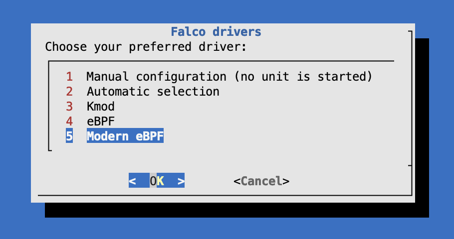

# Tests

This procedure allows you to test locally (on ubuntu) the k8saudit-ovh plugin.

## Build the plugin

```bash
cd ..
make build
```

## Install Falco (Ubuntu)

```bash
# Trust the falcosecurity GPG key
curl -fsSL https://falco.org/repo/falcosecurity-packages.asc | sudo gpg --dearmor -o /usr/share/keyrings/falco-archive-keyring.gpg

# Configure the apt repository
echo "deb [signed-by=/usr/share/keyrings/falco-archive-keyring.gpg] https://download.falco.org/packages/deb stable main" | sudo tee -a /etc/apt/sources.list.d/falcosecurity.list

sudo apt-get update -y

# TODO: pas besoin en Modern eBPF! ;-) 
# Install some required dependencies that are needed to build the Kernel Module and the eBPF probe
sudo apt install -y dkms make linux-headers-$(uname -r)
# If you use falcoctl driver loader to build the eBPF probe locally you need also clang toolchain
sudo apt install -y clang llvm
# You can install also the dialog package if you want it
sudo apt install -y dialog

# Install the Falco package
sudo apt-get install -y falco


```

Check the version is correctly installed

```bash
$ falco --version
Tue Dec 17 15:10:00 2024: Falco version: 0.39.2 (x86_64)
Tue Dec 17 15:10:00 2024: Falco initialized with configuration files:
Tue Dec 17 15:10:00 2024:    /etc/falco/falco.yaml | schema validation: ok
Tue Dec 17 15:10:00 2024: System info: Linux version 6.1.91-060191-generic (root@fcc34351b065) (x86_64-linux-gnu-gcc-12 (Ubuntu 12.3.0-1ubuntu1~22.04) 12.3.0, GNU ld (GNU Binutils for Ubuntu) 2.38) #202407021948 SMP PREEMPT_DYNAMIC Tue Jul  2 20:28:47 UTC 2024
Falco version: 0.39.2
Libs version:  0.18.2
Plugin API:    3.7.0
Engine:        0.43.0
Driver:
  API version:    8.0.0
  Schema version: 2.0.0
  Default driver: 7.3.0+driver
```

## Install FalcoCTL

```bash
LATEST=$(curl -sI https://github.com/falcosecurity/falcoctl/releases/latest | awk '/location: /{gsub("\r","",$2);split($2,v,"/");print substr(v[8],2)}')
curl --fail -LS "https://github.com/falcosecurity/falcoctl/releases/download/v${LATEST}/falcoctl_${LATEST}_linux_amd64.tar.gz" | tar -xz
sudo install -o root -g root -m 0755 falcoctl /usr/local/bin/falcoctl
```

Check the CLI is correctly installed:

```bash
$ falcoctl version
Client Version: 0.10.1
```
## Add Falco Plugin index

Add official artifacts index:

```bash
sudo falcoctl index add falcosecurity https://falcosecurity.github.io/falcoctl/index.yaml
```

Check the index is correctly added:

```bash
$ falcoctl index list
NAME            URL                                                     ADDED                   UPDATED
falcosecurity   https://falcosecurity.github.io/falcoctl/index.yaml     2024-12-17 15:41:56     2024-12-17 15:41:56
```

The index is not automatically updated, when a new artifact is added to the list, you can refresh your local cache with:

```bash
sudo falcoctl index update falcosecurity
```

## Add Falco JSOn plugin

Install Falco JSON plugin:

```bash
$ sudo falcoctl artifact install json
2024-12-17 15:44:42 INFO  Resolving dependencies ... 
2024-12-17 15:44:43 INFO  Installing artifacts refs: [ghcr.io/falcosecurity/plugins/plugin/json:latest]
2024-12-17 15:44:43 INFO  Preparing to pull artifact ref: ghcr.io/falcosecurity/plugins/plugin/json:latest
2024-12-17 15:44:44 INFO  Pulling layer 842b17048cf1 
2024-12-17 15:44:44 INFO  Pulling layer 556bb8728946                                                                                                   
2024-12-17 15:44:44 INFO  Pulling layer 63bc2beab61a                                                                                                   
2024-12-17 15:44:44 INFO  Verifying signature for artifact                                                                                             
                      └ digest: ghcr.io/falcosecurity/plugins/plugin/json@sha256:2872f704877e27c29cdcc2344df0611229e9e69eb9846697a3cf386b58171c18
2024-12-17 15:44:45 INFO  Signature successfully verified! 
2024-12-17 15:44:45 INFO  Extracting and installing artifact type: plugin file: json-0.7.3-linux-x86_64.tar.gz
2024-12-17 15:44:45 INFO  Artifact successfully installed                                                                                              
                      ├ name: ghcr.io/falcosecurity/plugins/plugin/json:latest
                      ├ type: plugin
                      ├ digest: sha256:63bc2beab61af4ba557fb5c18054afec5535cf6890934be270f5c405ecc02072
                      └ directory: /usr/share/falco/plugins
```

## Test Falco with k8saudit-ovh

```bash
$ falco -c falco.yaml -r k8s_audit_rules.yaml --disable-source=syscall
```